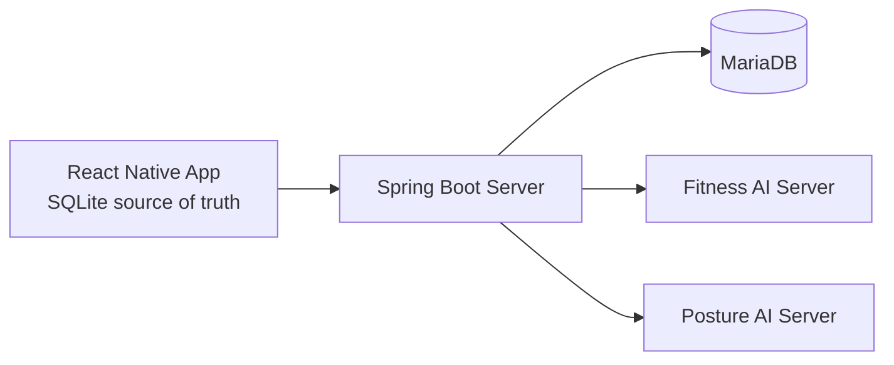
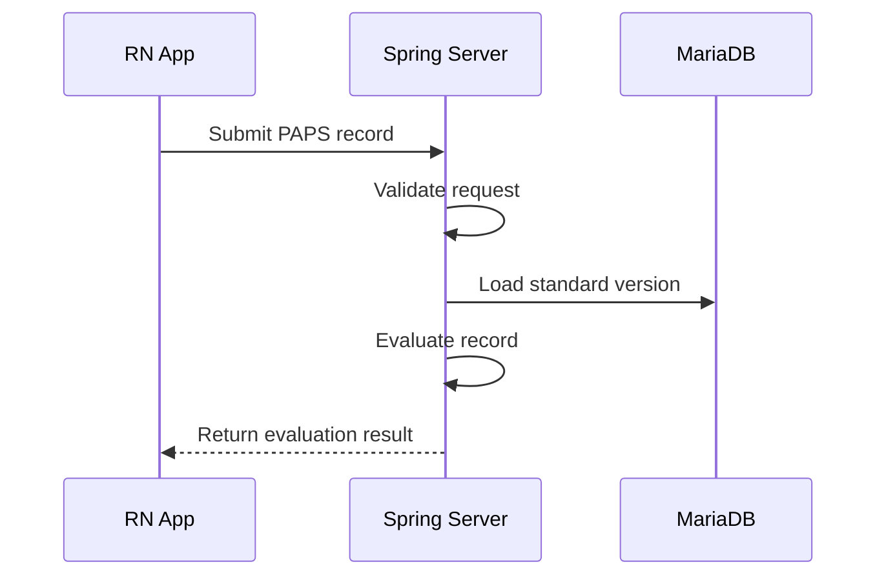
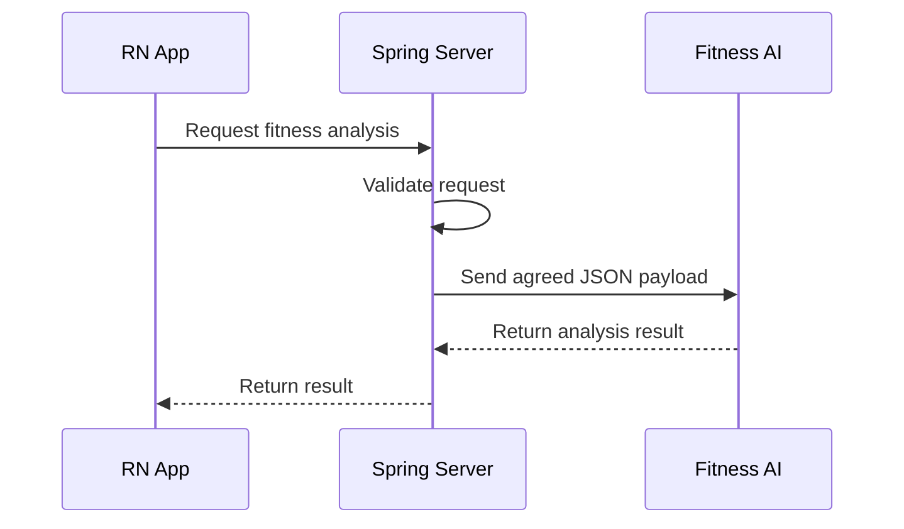
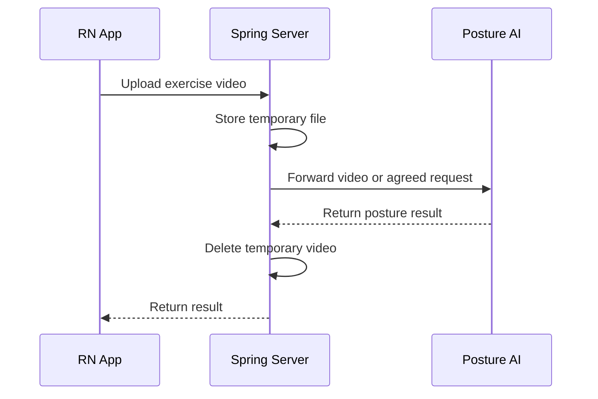

# Architecture

## Overview

The app keeps user-owned records locally. The server owns shared reference data, validates requests, evaluates PAPS records, and forwards agreed analysis payloads to AI servers.

## Why Local-First

The product does not require signup or login. Keeping long-term user data in RN SQLite reduces server-side privacy risk and avoids introducing identity, authorization, and account recovery flows before they are needed.

## Data Boundary

- Device data: user profile inputs, PAPS records, analysis history.
- Server data: PAPS items, standard versions, server common codes, AI analysis job state.
- Temporary server files: exercise videos only while forwarding posture analysis requests.

## PAPS Evaluation Flow

Official PAPS standards and temporary self-defined standards must be clearly distinguished in data.

## Fitness AI Analysis Flow

AI results are fitness-management reference information and must not be described as medical diagnosis.

## Posture Video Analysis Flow

Temporary videos must be deleted after success or failure. Raw videos and video paths must not be stored as long-term server data.

## Future Operations

- Decide whether production OpenAPI docs are private, disabled, or network-restricted.
- Define timeout, retry, and idempotency behavior with the AI team.
- Add observability without logging personal data or video paths.
- Revisit server-side user storage only if the product explicitly introduces accounts or cross-device sync.

