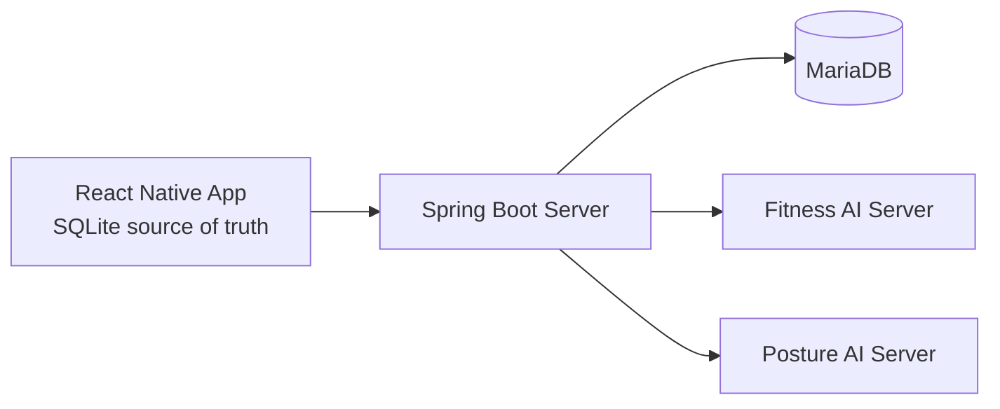
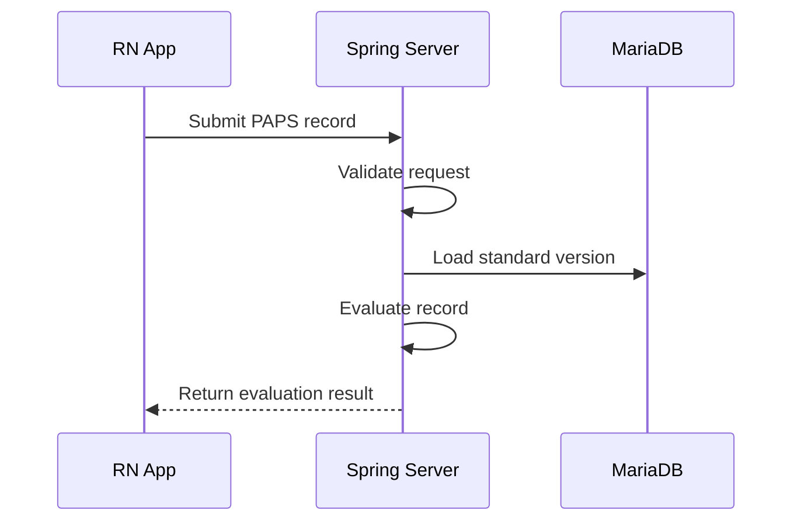
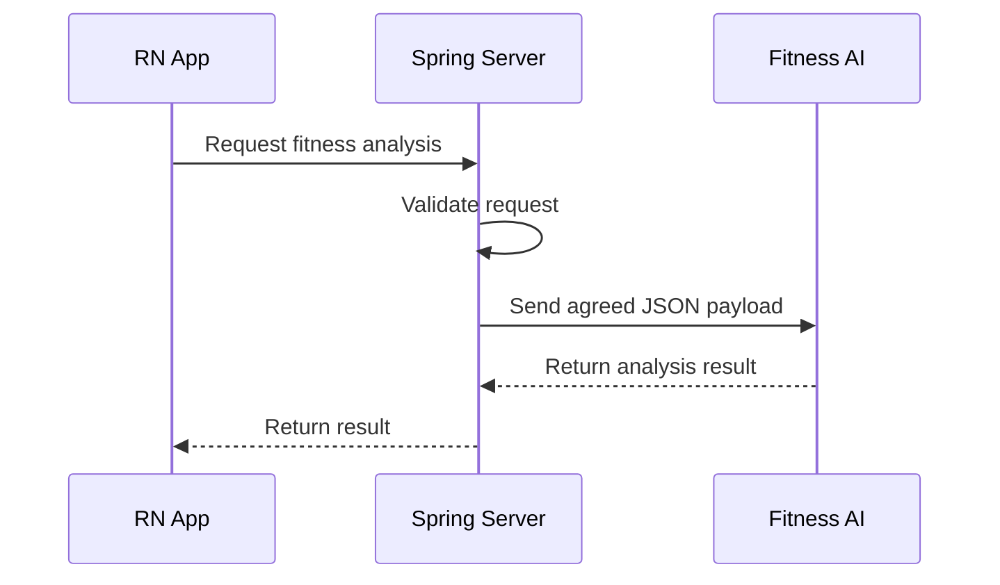
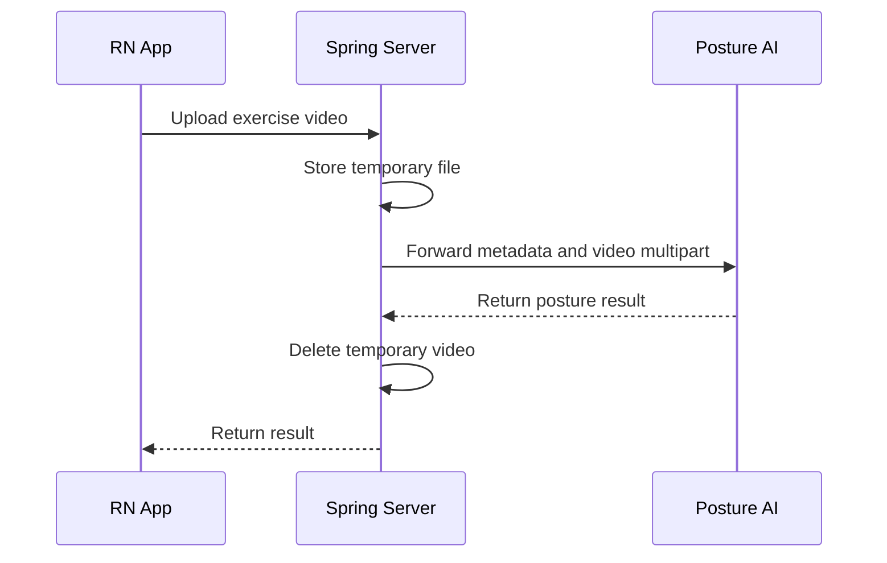

# Architecture

## Overview

The app keeps user-owned records locally. The server owns shared reference data, validates requests, evaluates PAPS records, and forwards agreed analysis payloads to AI servers.

## Why Local-First

The product does not require signup or login. Keeping long-term user data in RN SQLite reduces server-side privacy risk and avoids introducing identity, authorization, and account recovery flows before they are needed.

## Data Boundary

- Device data: user profile inputs, PAPS records, analysis history.
- Server data: PAPS fitness components, test items, standard versions, standard ranges, and temporary AI analysis job state.
- Temporary server files: exercise videos only while forwarding posture analysis requests.

The server persists `FitnessComponent`, `FitnessTestItem`, `PapsStandardVersion`, `PapsStandard`, and `AiAnalysisJob`. It does not persist member accounts, body profiles, PAPS assessment history, exercise solutions, or long-term posture feedback. `AiAnalysisJob` payloads are temporary data and must be deleted after expiration.

## PAPS Evaluation Flow

Official PAPS standards and temporary self-defined standards must be clearly distinguished in data.

Actual PAPS grade ranges are TODO until official source data or a team-approved internal standard is available.

## PAPS Reference Query API

The RN app reads PAPS reference metadata before submitting any future evaluation request:

- `GET /api/v1/paps/components` returns active fitness components.
- `GET /api/v1/paps/test-items` returns active measurement items.
- `GET /api/v1/paps/test-items?component={componentCode}` narrows measurement items to one component.
- `GET /api/v1/paps/standards/current` returns the single active standard version.

The standard version response includes `official`. `official=false` identifies an internal temporary standard; `official=true` identifies a version backed by an official PAPS source.

## PAPS Evaluation API

`POST /api/v1/paps/evaluations` accepts profile fields, `schoolGrade`, and PAPS measurement records, validates the request, calculates age from `assessmentDate`, calculates BMI on the server, loads the single active `PapsStandardVersion`, and evaluates each measurement against `PapsStandard` ranges.

The server does not persist evaluation requests or results. The RN app stores returned results in local SQLite. BMI is always generated from height and weight; client-provided `BMI` measurements are rejected. A request may include a partial set of fitness components, but it may include only one measurement item per component.

The MVP school-level policy is fixed to `HIGH` until the product defines an explicit school-level contract. The RN app must send the user's actual high-school grade as `schoolGrade` so official grade-level PAPS criteria are not inferred from age. The response includes item-level grades and completeness information. It does not include an overall grade because no official or team-approved aggregation policy is confirmed.

## Fitness AI Analysis Flow

AI results are fitness-management reference information and must not be described as medical diagnosis.

The RN app identifies a local installation with `X-Installation-Id`. The server hashes this value before storing AI job rows. This value is not authentication and does not replace user accounts.

## Posture Video Analysis Flow

Temporary videos must be deleted after success or failure. Raw videos and video paths must not be stored as long-term server data.

## Future Operations

- Decide whether production OpenAPI docs are private, disabled, or network-restricted.
- Define timeout, retry, and idempotency behavior with the AI team.
- Add observability without logging personal data or video paths.
- Revisit server-side user storage only if the product explicitly introduces accounts or cross-device sync.

